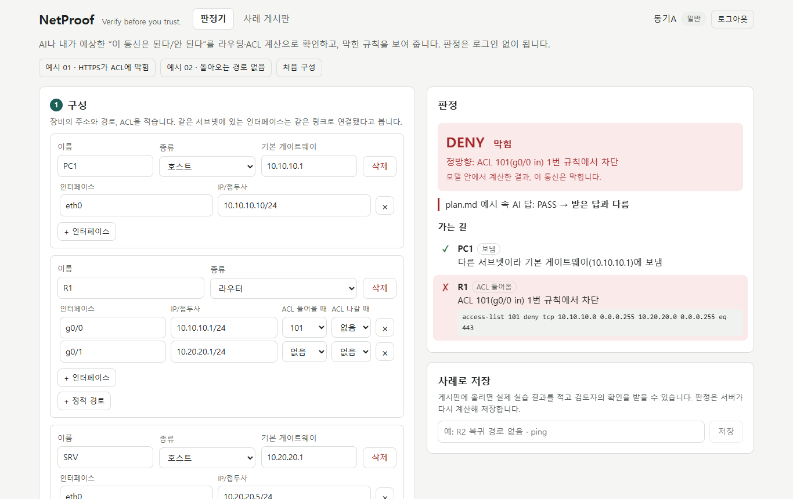
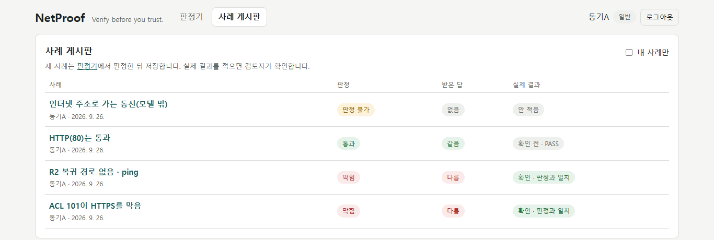
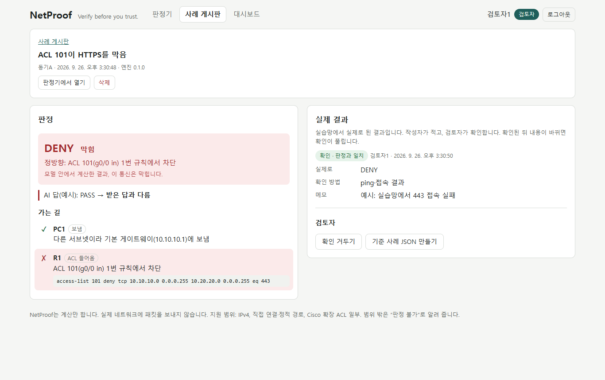
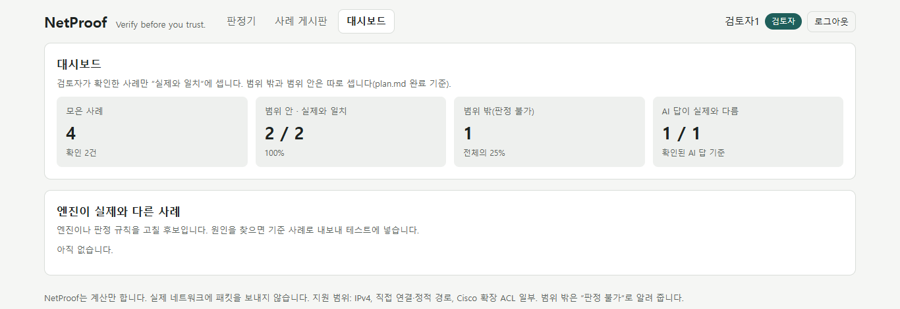
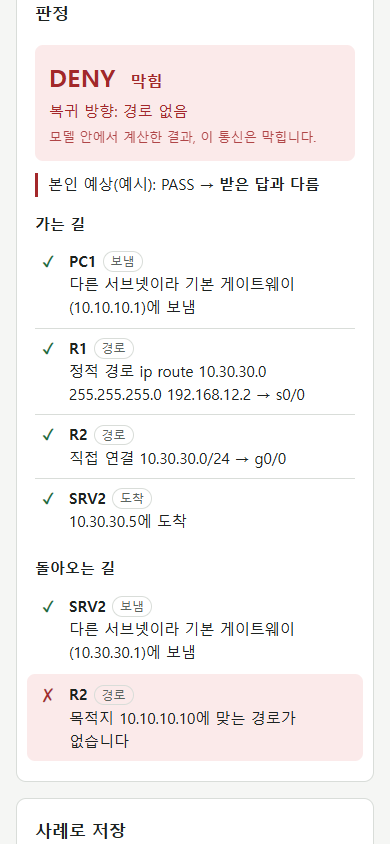

# NetProof — Verify before you trust.

AI나 내가 예상한 "이 통신은 된다/안 된다"를 라우팅·ACL 계산으로 확인하고, 막힌 규칙을 보여 주는 웹앱.
SKT ALEPH 프리미엄 실습 프로젝트. 계획은 [`plan.md`](plan.md), 판정 규칙은 [`docs/semantics.md`](docs/semantics.md).



| 사례 게시판 | 사례 상세 · 검토자 확인 |
|---|---|
|  |  |

| 대시보드(검토자) | 휴대폰 · 돌아오는 길에서 막힘 |
|---|---|
|  |  |

> 화면의 닉네임과 사례는 설명용 예시입니다(합성 사례, 실제 실습 결과가 아님). 동기들의 실제 사례는 사용자 테스트에서 모읍니다.

## 구조

| 폴더 | 내용 |
|---|---|
| `engine/` | 판정 엔진(Python, 표준 라이브러리만). 최종 PASS/DENY는 여기서만 정한다 |
| `server/` | Flask 서버. 로그인(Argon2id·서버 세션·CSRF·잠금), 사례 게시판, 검토자 등급, 대시보드, 크기 제한, 보안 헤더. 빌드된 화면도 함께 내보낸다 |
| `api/` | Vercel 서버리스 진입점 `index.py` 하나(서버를 불러 온다) |
| `web/` | React + TypeScript 화면: 판정기 · 로그인 · 사례 게시판 · 사례 상세 · 대시보드 |
| `cases/` | 기준 사례 파일. 지금은 합성 사례 2개뿐(실제 장비 결과 없음). 검토자가 확인한 사례를 내보내 여기에 넣는다 |
| `decisions/` | AI 작업 기록, 불일치 로그 |

## 권한

| | 비로그인 | 일반(동기) | 검토자 |
|---|---|---|---|
| 판정기 | ○ | ○ | ○ |
| 사례 게시판 보기 | × (401) | ○ | ○ |
| 사례 저장, 자기 사례의 실제 결과 적기·수정·삭제 | × | ○ | ○ |
| 실제 결과 확인 표시, 대시보드, 기준 사례 내보내기, 아무 사례 삭제 | × | × (403) | ○ |

검토자 등급은 웹에서 올릴 수 없다. 서버에서만: `.venv/Scripts/python -m flask --app server/wsgi.py make-reviewer <닉네임>` (되돌리기: `make-user`).
확인된 사례의 실제 결과나 구성이 바뀌면 확인은 자동으로 풀린다. 저장되는 판정은 언제나 서버가 다시 계산한 값이다.

## 실행 (Windows)

```bash
python -m venv .venv
.venv/Scripts/python -m pip install -e "engine[test]" -r requirements.txt
npm --prefix web install
npm --prefix web run build
.venv/Scripts/python -m flask --app server/wsgi.py run --port 4820
```

http://127.0.0.1:4820 에서 연다. DB는 기본으로 `instance/netproof.db`(SQLite)이고, `DATABASE_URL`로 PostgreSQL을 쓸 수 있다.
배포는 Vercel + Supabase — 순서와 누가 무엇을 하는지는 [`docs/deploy.md`](docs/deploy.md). 화면을 고치는 중이면 `npm --prefix web run dev`(5820, API는 4820으로 넘김).

## 검사

```bash
cd engine && ../.venv/Scripts/python -m pytest -q   # 엔진: 단위·속성·사례 파일
cd server && ../.venv/Scripts/python -m pytest -q   # 서버: 로그인·권한·게시판·대시보드·배포 설정
npm --prefix web test                               # 화면: 입력 변환·주소
```

사례 하나를 명령줄에서 판정: `PYTHONPATH=engine/src .venv/Scripts/python -m netproof_engine cases/synthetic-01-https-acl.json`

## 하지 않는 것

실제 네트워크에 패킷을 보내지 않는다(ADR-011). IPv6·NAT·동적 라우팅·VLAN·상태 기반 방화벽은 v1 범위 밖이며, 판정에 필요하면 "판정 불가(UNSUPPORTED)"로 멈춘다.

## 라이선스

[MIT](LICENSE)
