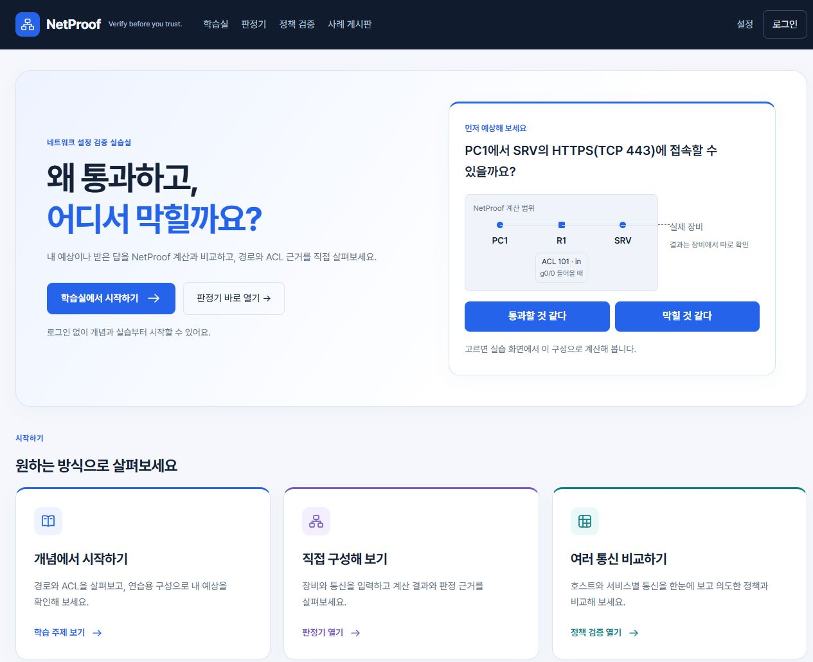
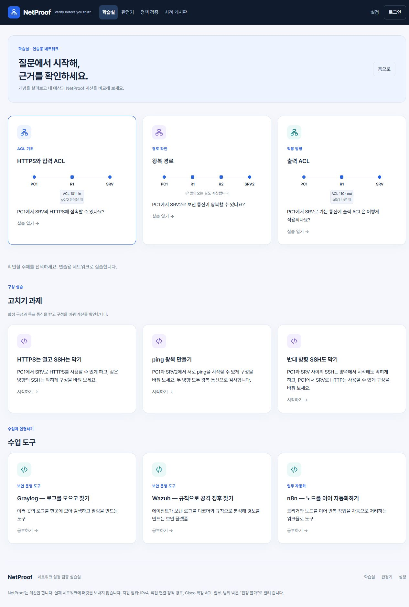
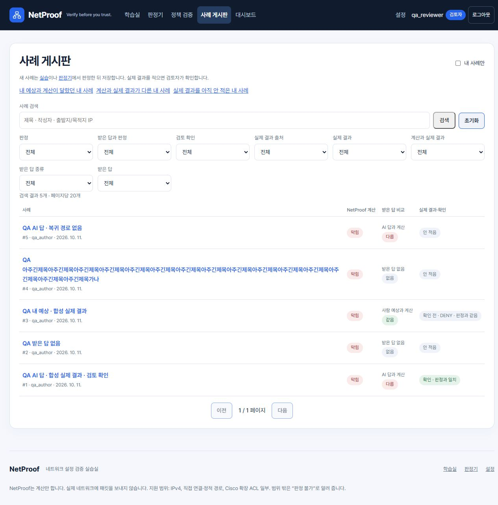
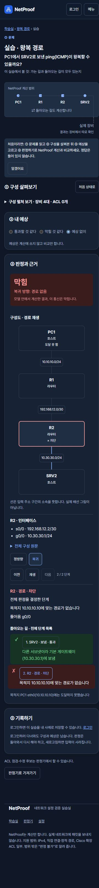

# 프론트 리디자인

2026-10-11 사용자가 동기의 [정보처리기사 학습 사이트](https://information-processing-study.vercel.app/)를 참고한 프론트 전체 리디자인을 선택했다. 이번 과제에 한해 Codex가 설계·구현을 함께 맡고 이후 리뷰를 받도록 명시했다.

참고한 공개 홈의 남색 헤더, 밝은 배경, 파란 주요 행동, 여백과 둥근 카드의 일관성을 NetProof에 적용한다. 로그인 이후 화면은 확인하지 못했으므로 내부 화면을 복제했다고 설명하지 않는다. 아이콘은 직접 작성한 SVG이며 외부 이미지나 새 패키지를 가져오지 않는다.

## 화면 기준

- 공통: 전체 폭의 남색 헤더와 가운데 정렬한 본문, 파란 주요 버튼, 중립적인 보조 버튼, 같은 카드·입력·표·포커스 스타일. 브랜드 옆 작은 네트워크 아이콘과 본문 바로가기. 모바일 메뉴는 기존 Escape·닫힘·키보드 순서를 유지한다.
- 홈: 기존 예상 퍼즐과 이어서 하기 맥락을 유지한다. 제목 일부를 파란색으로 강조하고 학습실·판정기 진입을 제공한다. 그 아래 학습·직접 판정·정책 검증 카드와 기존 주제·사례 게시판 안내를 둔다. 학습 기록이나 진행률을 만들지 않는다.
- 학습실: 소개 영역과 주제 카드를 공통 스타일로 정돈한다. 연습 주제·고치기 과제·수업 도구는 각각 제목과 설명으로 구분한다. 기존 내용·질문·링크를 유지하고 아이콘과 장식 색을 보탠다.
- 실습·고치기·판정·정책 검증: 구성 편집과 결과의 영역을 같은 카드 체계로 읽기 쉽게 만든다. 화면 폭이 작으면 세로로 배치하고, 표와 ACL 원문은 필요한 영역 안에서 읽게 한다. 판정기의 모바일 고정 버튼과 기존 접기 동작을 유지한다.
- 사례 목록·상세·대시보드·로그인·설정: 같은 제목 계층·여백·테두리·입력 체계를 적용한다. 받은 답·엔진 계산·실제 결과·확인의 의미와 색상은 유지한다. 제목이 있는 화면은 h1으로 구분한다.

## 구현 경계

변경 대상은 `web/src`의 표시 코드·CSS·웹 테스트, 이 문서·화면 캡처, `HANDOFF.md`, `decisions/ai-work-log.md`다. 판정·API 호출·입력 메모리·revision/current()·재생·저장·검색·인증·집계는 바꾸지 않는다. 엔진·서버·기준 사례·expect·배포·의존성은 변경하지 않는다. 고치기 해법을 화면·문서·번들에 추가하지 않고 점수·완료·성공·정답·%나 축하 표시를 추가하지 않는다.

## 검증

엔진·서버 pytest, 웹 test·build, 변경 금지 경로 diff와 공백 검사를 직접 실행한다. 로컬 전용 임시 SQLite QA 서버에서 공개 화면과 합성 사례·검토자 화면을 확인한다. 320·375·1280px 라이트/다크, 모바일 메뉴·Escape·포커스·본문 바로가기·학습 진입·판정·재생·사례·정책 검증을 확인하고 실제 캡처와 결과를 HANDOFF에 남긴다. 운영 DB를 사용하지 않으며 끝나면 QA 서버와 임시 DB를 정리한다.

## 구현 화면과 결과

아래는 2026-10-11 최종 빌드의 로컬 제품 화면이다. 서버는 127.0.0.1·임시 SQLite만 사용했고 종료 후 DB를 삭제했다. 사례 화면의 계정·사례·실제 결과는 모두 QA 합성 데이터다. 운영 배포는 수행하지 않았다.

엔진489 passed·2 xfailed, 서버227 passed·1 skipped, 웹645 passed, 웹 build 완료. 최종 번들은 CSS `index-AgU_oDiV.css`·JS `index-1tzp9H12.js`다. 320·375·1280px 라이트/다크 84개 조합의 배치와 JS 진단은 [원문 JSON](screens/frontend-qa.json), 명령·출력과 실제 사용한 흐름은 [HANDOFF 테스트 결과](../HANDOFF.md#테스트-결과--프론트-전체-리디자인-codex-직접-실행-2026-10-11)에 있다. 이 검사는 모든 사용자 상태나 실제 장비 결과를 대조한 검사는 아니다.

Codex (GPT-6)
