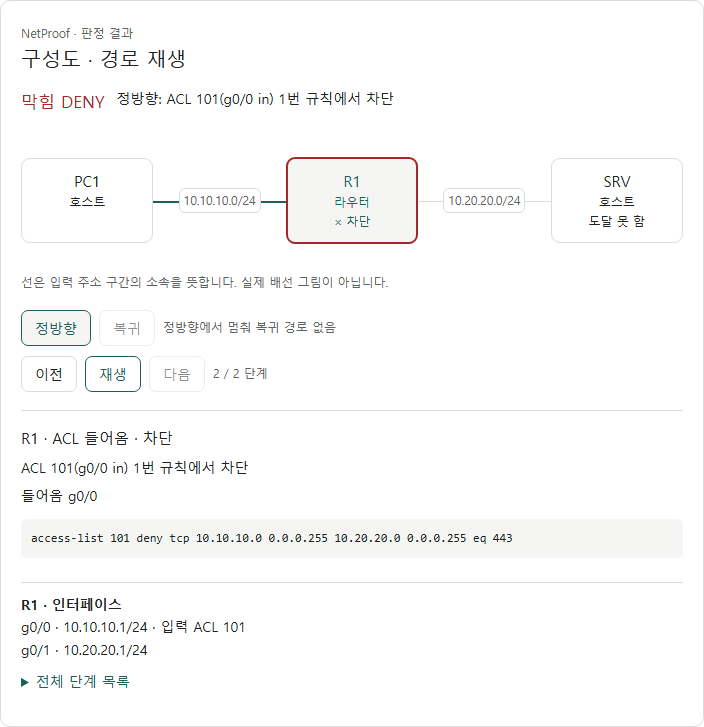
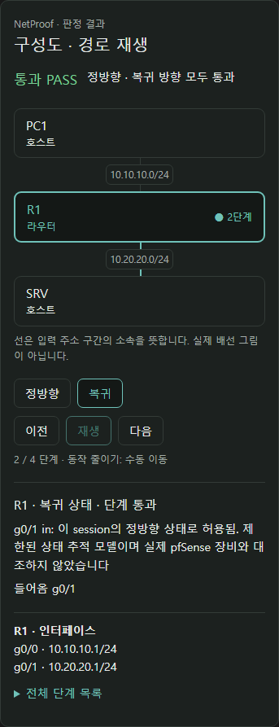
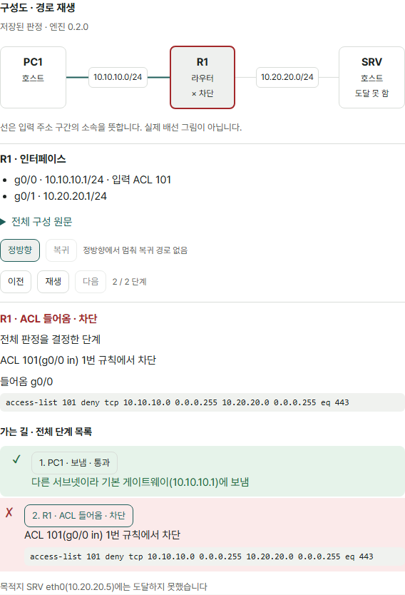
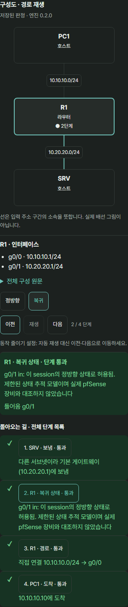

# 구성도 그림과 경로 재생 설계

2026-10-10 · 기준 main `d7dabff`(PR #50 병합) · 설계: Codex (GPT-6)

사용자가 이번 설계를 Codex에게 맡겼고, 범위는 **구성도 + 경로 재생**으로 선택했다. 설계 PR #51을 작성한 뒤 사용자가 2026-10-10 구현을 승인했다. 아래는 승인된 구현 범위·재생 규칙이며, 구현 결과는 HANDOFF의 테스트 결과에 기록한다.

## 목표와 근거

판정 결과를 읽을 때 장비가 어떤 주소 구간으로 연결되는지, 통신이 어느 장비의 어느 단계에서 멈추는지 한 화면에서 따라간다. 그림과 재생은 **이미 받은 엔진 응답을 설명**한다. 그림의 선이나 재생 위치로 PASS/DENY를 계산하지 않는다(ADR-001).

현재 `ResultPanel.tsx`는 장비 이름을 나열한 Strip과 정방향·복귀 단계 목록을 제공한다. 주소 구간 그림과 재생은 없다. 엔진에는 `firewall_in`·`state` 단계가 있지만 웹의 `Hop.step`·표시 문구에는 빠져 있다. 이 두 단계도 실제 응답대로 표시해야 한다. `JudgePage`·`PracticePage`에는 판정 당시 network와 flow가 있고, 사례 상세는 저장된 network·flow·verdict를 가진다. 정책 행렬도 같은 ResultPanel을 쓴다.

## 화면 제안

제품에 아직 적용하지 않은 시안이다. 데스크톱은 기존 사례 01의 ACL 차단, 모바일은 합성 stateful 구성의 복귀 상태 단계를 선택한 화면이다. 판정·단계 설명은 현재 엔진 응답이다.

결과 패널에서 기존 결과·비교·원인 설명을 유지하고, 그 아래 장비 Strip 대신 **구성도 · 경로 재생**을 둔다. 순서는 결과 요약 → 구성도 → 방향·재생 조작 → 선택 단계 → 기존 전체 단계 목록이다. 사례의 장비·인터페이스·ACL 원문 목록도 유지한다.

- 구성도: 장비와 주소 구간을 함께 표시한다. 처음에는 해당 방향의 마지막 단계가 선택되어 멈춘 지점 또는 도착을 바로 볼 수 있다. 최종 엔진 결과는 처음부터 보이며 재생 중에도 바뀌지 않는다.
- 방향: `정방향`·`복귀` 버튼. 복귀 응답이 없으면 버튼을 비활성화하고 아래 표의 이유를 표시한다. 복귀 경로를 정방향 역순으로 만들지 않는다.
- 조작: `이전`·`재생/일시정지`·`다음`, `현재 단계 / 전체 단계`. 각 목록 항목의 버튼으로 직접 선택할 수 있다. 속도 선택·반복·편집·드래그·확대 기능은 첫 구현에 넣지 않는다.
- 선택 단계: 장비, 단계 이름, ok/drop의 한국어 표시, 입출력 인터페이스, 엔진 `detail`, 존재할 때 규칙 원문. 해당 ACL 메타데이터가 있으면 기존 `AclEvidence`의 규칙 보기 동작을 재사용한다. 방화벽 규칙은 원문만 보여 준다.
- 장비 선택: 장비의 원래 인터페이스·주소·ACL 참조를 보여 주고 재생 커서는 유지한다. 단계 선택 시 해당 단계의 장비를 다시 선택한다. 장비 선택과 단계 선택은 별도 상태다.

| 받은 응답 | 표시와 조작 |
| --- | --- |
| PASS + 양방향 trace | 방향별 독립 재생, 성공은 각 trace의 `delivered`로 표시 |
| DENY + 정방향 drop | 그 장비·단계에 `차단` 표시. 목적지는 `trace.target`이 있으면 `도달 못 함`. 복귀는 `정방향에서 멈춰 복귀 경로 없음` |
| DENY + 복귀 drop | 정방향은 도착 표시, 복귀에서만 차단 강조. 전체 결과 DENY 유지 |
| one-way + return 없음 | `one-way 통신: 복귀 경로를 계산하지 않음` |
| INVALID/UNSUPPORTED + trace 없음 | 결과·이유·문제 목록 유지, `재생할 경로 없음`. 유효하게 표시 가능한 입력 장비만 정적인 구성도로 표시 |
| 예전 저장 응답에 target 없음 | 목적지 도달 여부나 장비를 추측하지 않는다. 기존 단계 목록을 그대로 표시 |
| 판정 전 | 결과 패널의 그림은 아직 없다. 기존 입력 UI 유지 |
| 편집 후 이전 결과(stale), 새 판정 요청 중(loading) | 이전 **판정 당시 구성도**를 정지 상태로 유지, 재생 조작 비활성화. 기존 다시 판정 안내 유지 |

이 구성도는 **입력으로 만든 모델 연결**이며 실제 케이블·스위치·VLAN·NAT·인터넷 경로 그림이 아니다. 그림 아래에 이 뜻을 짧게 항상 표시한다. pfSense 입력 화면·실습망 사진 재작성은 별도 과제다.

## 구성도 데이터와 배치

1. network의 각 장비를 장비 노드로 만든다. 키는 장비 id, 라벨은 원래 id와 host/router다. 인터페이스를 별도 장비처럼 만들지 않는다.
2. 유효한 IPv4 CIDR을 **네트워크 주소 + prefix**로 정규화하여 주소 구간 노드를 만든다. `10.10.10.10/24`와 `10.10.10.1/24`는 `10.10.10.0/24`에 속한다. `/24`와 `/25`처럼 겹치지만 같지 않은 구간은 합치지 않는다(의미론 §3).
3. 장비 인터페이스와 해당 주소 구간 사이에 중립 선을 그린다. 이 선은 구간 소속만 뜻한다. 게이트웨이·정적 경로로 새 선을 만들거나 next-hop 도달 가능성을 계산하지 않는다. 혼자 있는 구간·떨어진 장비도 남긴다.
4. 주소 파싱은 기존 `validate.ts` 규칙과 같은 유효 범위를 쓴다. 빈 문자열은 유효 CIDR로 취급하지 않는다. 비정상·너무 긴 값은 수치 변환 전에 배제하고 원문 목록에서 보여 준다. INVALID의 중복 id 등 안전한 그림 키를 만들 수 없으면 그림 대신 목록을 표시한다.
5. 시작 장비는 입력 flow.src와 인터페이스의 원래 IP가 같은 장비가 **하나일 때만** 배치의 시작점으로 쓴다. 경로 추정에는 쓰지 않는다. 그 외에는 입력 순서가 기준이다. 시작점에서 구간 소속 선을 따라 층을 만들고, 동률은 입력 순서로 정한다. 떨어진 성분은 뒤에 별도로 배치한다. 배치는 결정적이며 force simulation·무작위 위치·추가 패키지는 쓰지 않는다.
6. 넓은 화면은 층을 가로로, 좁은 화면은 세로로 배치한다. 컨테이너 실제 폭을 측정하고 라벨 길이에 맞춰 노드 높이와 간격을 잡는다. 장비 id·인터페이스·CIDR은 잘라 숨기지 않고 줄바꿈한다. 최소 12px 라벨, 터치 조작 약 44px, 320px에서 가로 넘침이 없어야 한다.
7. 첫 구현은 **장비 12개·주소 구간 24개 이하**에서 전체 구성도를 표시한다. 둘 중 하나가 넘으면 `큰 구성: 경로 장비만 표시`로 명시하고 해당 방향 trace에 나온 장비와 그 장비의 주소 구간을 표시한다. target은 엔진이 제공했을 때만 더한다. 이것도 상한을 넘으면 장비별 세로 경로 목록으로 전환한다. trace가 없으면 전체 원문 목록으로 전환한다. 전체 구성은 기존 목록에서 항상 읽을 수 있다. 이 상한은 표시 제안이며 서버 입력 상한·엔진 계산을 바꾸지 않는다.

## 경로와 재생 상태

입력은 `{ network, flow, verdict }`라는 **한 번의 판정 스냅샷**이다. 저장 사례에서는 `{ network, flow, verdict, engine_version }`를 그대로 사용하고 `저장된 판정 · 엔진 X`를 표시한다. 오래된 버전이라도 브라우저에서 자동 재판정하지 않는다. 현재 입력 draft와 이전 verdict를 섞지 않는다.

재생 상태는 `direction`, 원래 hops의 `stepIndex`, `playing`, `selectedDeviceId`뿐이다. DB·URL·localStorage에 저장하지 않는다. 전진·후진은 원래 배열 인덱스를 바꾼다. 연속 같은 장비의 여러 단계도 각각 재생하고, 같은 장비의 재방문도 전부 남긴다.

| step | 단계 이름 | drop일 때 |
| --- | --- | --- |
| send | 보냄 | 보내지 못함 |
| acl_in | ACL 들어옴 | 들어올 때 ACL 차단 |
| firewall_in | 방화벽 들어옴 | 방화벽에서 차단 |
| state | 복귀 상태 | 상태 단계에서 멈춤 |
| route | 경로 | 경로 단계에서 멈춤 |
| acl_out | ACL 나감 | 나갈 때 ACL 차단 |
| deliver | 도착 | 받지 못함 |

`state`가 ok이면 **그 단계의 복귀 상태 통과**라고만 설명한다. 새로운 연결 허용이나 모든 방화벽 규칙 허용으로 확대하지 않는다. 알 수 없는 미래 step은 `알 수 없는 단계: 원래 값`으로 원문과 detail을 남기고 판단을 추가하지 않는다.

- 그래프의 기본 선은 중립으로 유지한다. 현재 장비에 위치 표식을 놓고 단계 번호를 함께 표시한다. `drop`은 X와 `차단`, `deliver`는 `도착`을 함께 표시하여 색만으로 구분하지 않는다.
- 진행 경로는 **현재 인덱스까지 실제로 나타난 장비 전환**만 강조한다. 같은 장비의 ACL·경로 단계 동안 다음 장비로 표식을 보내지 않는다. send/route의 drop 뒤 목적지까지 선을 강조하지 않는다.
- 서로 다른 연속 hop 장비를 잇는 강조선은 양쪽의 기록된 인터페이스와 구성도 소속 선이 맞을 때만 기존 선 위에 그린다. 인터페이스 누락·구간 불일치·알 수 없는 장비면 `단계에 기록된 이동(구성도 연결 정보 없음)`으로 목록에 표시한다. 연결을 발명하지 않는다.
- 엔진 `decisive`는 결과 근거다. 각 trace의 실제 drop 위치를 유지하되, **전체 판정을 결정한 단계**라는 표시는 decisive와 모든 필드가 같은 drop을 정방향/복귀에서 찾고 해당 방향·인덱스에만 붙인다. 유일하게 찾지 못하면 결과 근거 원문만 표시한다. ok hop을 근거로 만들거나 복귀 실패를 정방향 실패로 표시하지 않는다.
- 재생을 누르면 첫 단계부터 시작하여 1초마다 한 단계 전진하고 마지막에서 멈춘다. 일시정지 후 재생은 다음 단계부터 이어간다. 마지막에서 다시 재생하면 첫 단계부터 시작한다. 수동 이동·방향 변경·장비 선택은 재생을 멈춘다.
- 방향을 바꾸면 그 방향의 마지막 단계를 선택한다. 새로운 판정 스냅샷이 수락되면 decisive와 유일하게 일치하는 drop이 복귀에 있을 때만 복귀 마지막 단계와 그 장비를 선택한다. 그 밖에는 정방향 마지막 단계로 초기화한다. 네트워크 편집·loading·stale·unmount·문서 숨김에서 타이머를 즉시 해제한다. 다시 보이는 것만으로 자동 재개하지 않는다.
- `prefers-reduced-motion`이면 자동 재생을 비활성화하고 이유를 표시한다. 이전·다음·단계 선택은 계속 쓸 수 있다. 켜지는 순간 실행 중 타이머도 멈춘다.

## 적용 화면과 구현 경계

| 위치 | 데이터 전달과 변경 |
| --- | --- |
| JudgePage | 수락한 판정의 network·flow를 함께 ResultPanel에 전달. 현재 draft로 구성도를 그리지 않음 |
| PracticePage | 같은 스냅샷 규칙. 재생·장비 선택은 저장 버튼 유효성·예상·입력을 바꾸지 않음 |
| CaseDetailPage의 CaseCalculation | item.network·flow·verdict·engine_version. CaseNetwork 원문 목록 유지 |
| PolicyMatrixPage | 선택한 셀의 정확한 flow와 checked.network·verdict를 함께 전달. 셀/행렬 변경 시 정지·초기화. 재생은 API 호출 없음 |

예상 변경 파일은 `web/src/types.ts`, `components/ResultPanel.tsx`, 새 `components/NetworkDiagram.tsx`·`TracePlayer.tsx`, 순수 표시 함수 `topologyView.ts`·`tracePlayback.ts`, 위 네 페이지, `styles.css`, 해당 웹 테스트와 문서다. 실제 파일 분할은 구현 시 조정 가능하되 기능 범위는 유지한다. `Hop.step`에 두 누락 값을 보완하고 표시 map을 함께 보완한다. 상태 추적 배지가 필요하면 읽기용 `Device.stateful?`만 추가하고 draft 변환·pfSense 편집은 바꾸지 않는다.

엔진 계산·버전, 서버/API/DB, cases/*.json·expect, 배포 구성·운영 DB는 변경하지 않는다. `PathStrip`의 학습 그림·입력 편집·실제 결과 확인·사례 저장·다운로드·대시보드 집계도 범위 밖이다. 엔진 응답 의미가 같으므로 버전은 0.2.0 유지(의미론 §15).

## 접근성과 검증 계획

SVG는 중복 설명이므로 `aria-hidden`으로 두고, 장비 선택은 SVG 밖의 native button, 단계 목록은 순서 있는 목록과 native button으로 만든다. 선택 단계에 `aria-current="step"`, 선택 장비·방향에 `aria-pressed`를 둔다. 방향은 페이지 탭으로 구현하지 않는다. 재생 제어에는 보이는 글자를 쓰고 키보드 기본 동작·포커스를 유지한다. 수동 단계 선택·시작·정지는 polite live 영역에 알리지만 타이머 tick마다 알리지 않는다.

승인한 구현 PR 완료 조건은 다음과 같다. 실제 수행 결과는 HANDOFF의 「테스트 결과 — 구성도·경로 재생 구현」에서 확인한다.

1. 기존 사례 01/02/03으로 정방향 ACL 차단·복귀 경로 실패·출력 ACL 차단을 재생하고 엔진 결과·원문 목록과 같음을 확인한다. 추가 PASS·state·firewall·one-way·INVALID·UNSUPPORTED는 기존 엔진 응답을 얻은 웹 테스트 fixture로 시험한다. cases 파일과 expect는 손대지 않는다.
2. 순수 함수 시험: 동일 정규 CIDR 묶기, 겹친 prefix 분리, /0·/32·비정상/빈/거대 문자열, 떨어진 성분, 입력 순서 결정성, 중복 id fallback, 12/13 장비·24/25 구간, 긴 이름. 구성도 생성이 verdict를 수정하지 않음을 확인한다.
3. 경로 시험: 연속 같은 장비·장비 재방문·루프 종료·send drop·hop 인터페이스 누락·없는 장비·target 없음·유일하지 않은 decisive·알 수 없는 step. ok 단계는 전체 성공으로 확대하지 않고 미기록 연결은 만들지 않는다.
4. fake timer 시험: 첫/마지막 경계, 일시정지/이어가기, 방향·스냅샷·행렬 셀 변경, stale/loading, 편집·unmount·visibilitychange·reduced motion 전환에서 타이머 해제·자동 재개 없음. 재생만으로 API 호출·저장 요청이 늘지 않음을 확인한다.
5. 네 적용 화면에서 판정 스냅샷 일치, 사례 버전 표시, 저장·재판정 흐름 회귀, 기존 AclEvidence와 전체 단계 목록 사용 가능성을 시험한다. 320·375·1280px 라이트/다크 및 reduced motion에서 가로 넘침·라벨/조작 겹침·콘솔 오류·키보드 선택을 직접 확인한다.
6. 엔진 pytest·서버 pytest·웹 test·웹 build를 직접 실행하여 출력을 HANDOFF에 기록하고 `git diff --check`, 엔진·서버·cases·배포 불변 diff를 확인한다.

## 시안의 검증 범위

대화 시안은 기존 사례 3건과 메모리에서 만든 PASS·stateful·UNSUPPORTED 구성의 **현재 엔진 verify 응답**을 사용한다. 실제 사용자 사례나 운영 DB는 쓰지 않았다. 이 시안은 작은 구성의 배치·방향 선택·단계 이동을 검토하기 위한 것으로, 제품에 설치된 기능이 아니다. 큰 구성 fallback·네 페이지 연결·저장 회귀는 구현 PR에서 검증한다.

## 구현 화면 (2026-10-10)

아래는 시안이 아니라 빌드된 제품을 로컬 QA 서버와 임시 SQLite에서 확인한 화면이다. 위 원래 설계 이미지는 비교를 위해 유지한다. 운영 배포·실제 장비 대조는 수행하지 않았다.

Codex (GPT-6)
